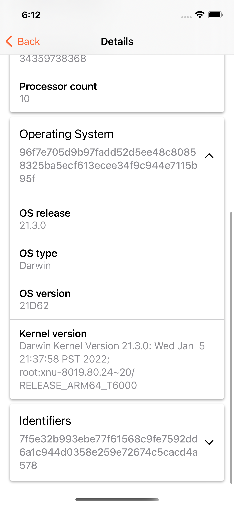
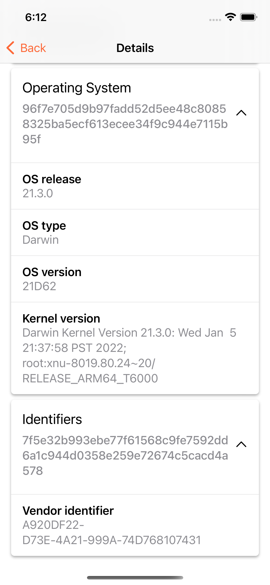

<p align="center">
  <a href="https://fingerprint.com">
    
  </a>
</p>
<p align="center">Lightweight iOS library for local device fingerprinting</p>

<p align="center">
  <a href="https://github.com/fingerprintjs/fingerprintjs-ios/actions/workflows/ci.yml">
    
  </a>
  <a href="https://www.swift.org/download/">
    
  </a>
  <a href="https://fingerprint.com/sdk-libraries/">
    
  </a>
  <a href="https://cocoapods.org/pods/FingerprintJS/">
    
  </a>
</p>

<p align="center">
  <a href="https://discord.gg/39EpE2neBg">
    
  </a>
</p>

<p align="center">
  <b>Demo application on the App Store</b>
</p>
<p align="center">
  <a href="https://apps.apple.com/us/app/fingerprintjs-showcase/id1621330481?itsct=apps_box_badge&amp;itscg=30200" style="display: inline-block; overflow: hidden; border-radius: 13px; width: 250px; height: 83px;"></a>
</p>

<p align="center">
  
  
  
  
</p>


## Installation (CocoaPods)

```ruby
# Podfile
pod 'FingerprintJS'
```

Note: If you've never used CocoaPods for dependency management, check out their [Using CocoaPods](https://guides.cocoapods.org/using/using-cocoapods.html) guide that will walk you through the setup process.

## Quick Start (async/await - preferred)

```swift
import FingerprintJS
 
let fingerprinter = FingerprinterFactory.getInstance()
Task {
    // Get fingerprint for the current device
    if let fingerprint = await fingerprinter.getFingerprint() {
      // Do something awesome with the fingerprint  
    }
}
```

## Quick Start (closures - backwards compatibility)

```swift
import FingerprintJS 

let fingerprinter = FingerprinterFactory.getInstance()
fingerprinter.getFingerprint { fingerprint in
    // Do something awesome with the fingerprint
}
```

## Fingerprint vs. DeviceId

`FingerprintJS` provides two main methods that return different kinds of identifiers:

1. Device identifier retrieved by calling `Fingerprinter::getDeviceId()` that internally uses the `identifierForVendor()` method which returns a unique identifier for the current application (tied to the device). `FingerprintJS` further remembers this identifier in the keychain, making the identifier stable even between app reinstalls. 

2. `Fingerprinter::getFingerprint()` computes a device fingerprint by gathering device information (hardware, OS, device settings, etc.) and computing a  hash value from available items. The fingerprint isn't currently as stable as the Device Identifier, because the values might change between OS updates or when the user changes settings used to compute the previous value. Furthermore, the fingerprint stability can be customized by supplying the `stabilityLevel` option to the `Configuration` object.

## Configuration

`Fingerprinter` instance can be configured through the `Configuration` object that provides options to select the fingerprint version, set the desired fingerprint stability level, or change the algorithm that is used to compute the individual fingerprints.

```swift
// note that this example exists only to illustrate the available options
// and that its outcome mirrors the current default configuration

let configuration = Configuration(version: .latest, stabilityLevel: .optimal, algorithm: .sha256)
let fingerprinter = FingerprinterFactory.getInstance(config)

// fingerprinter uses latest fingerprint version with OPTIMAL stability level and SHA256 algorithm
```

### Fingerprint Stability Levels

There are three different fingerprint stability levels, as defined in `FingerprintStabilityLevel` enum.

* `unique` that indicates the use of every signal the library is able to collect. This stability level is recommended for obtaining the most accurate fingerprint.
* `optimal` that indicates the use of a combination of signals that don’t change and signals that might change, though not very often. This is the default stability level and it is recommended as providing the best balance between fingerprint stability and fingerprint accuracy.
* `stable` that indicates the use of hardware signals or signals that aren’t supposed to change at all. This stability level is recommended for obtaining the most stable fingerprint.

> **NOTE:** The supplied stability level is only applicable in fingerprint version `v3` and later, such that it is ignored if you use fingerprint versions `v1` or `v2`.

### Creating Custom Fingerprinting Function

The default hashing function which computes the fingerprint from the content data is SHA256. The `Configuration` object offers a way to inject a custom hashing function by specifying `.custom(YourCustomFingerprintFunctionInstance)` in the `algorithm` variable:

```swift
struct HitchhikersFunction: FingerprintFunction {
    func fingerprint(_ data: Data) -> String {
        return "42"
    }
}

let fingerprintFunction = HitchhikersFunction()
let config = Configuration(version: .latest, stabilityLevel: .optimal, algorithm: .custom(fingerprintFunction))
let fingerprinter = FingerprinterFactory.getInstance(config)

let fingerprint = await fingerprinter.getFingerprint() // returns "42"
```

Keep in mind that the change in the supplied hashing function will inevitably lead to the change of the output fingerprint.

## Android Version

- [Fingerprint Android - identification and fingerprinting in native apps](https://github.com/fingerprintjs/fingerprintjs-android)

## License

This library is MIT licensed. Copyright FingerprintJS, Inc. 2023.
